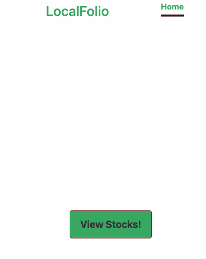
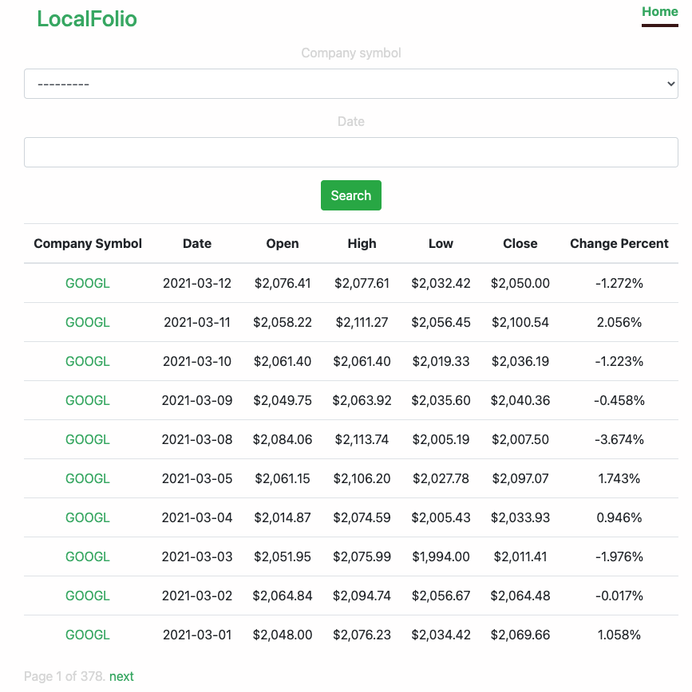
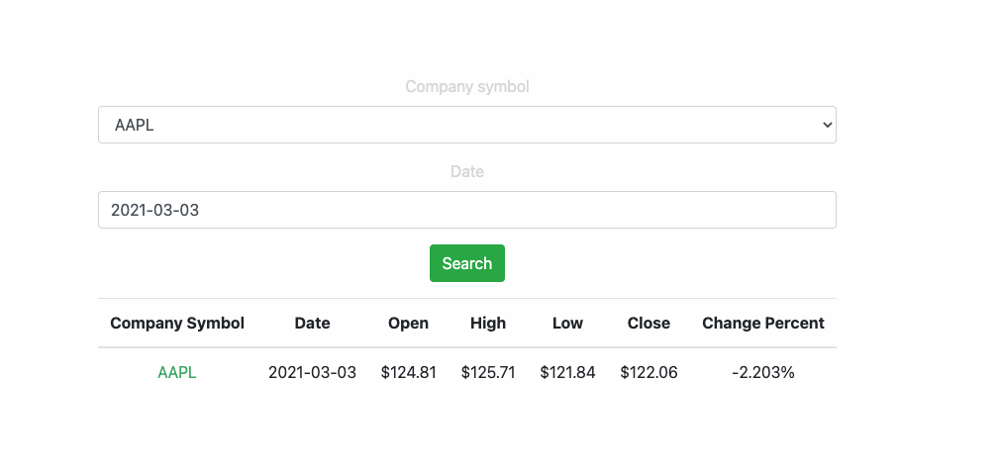
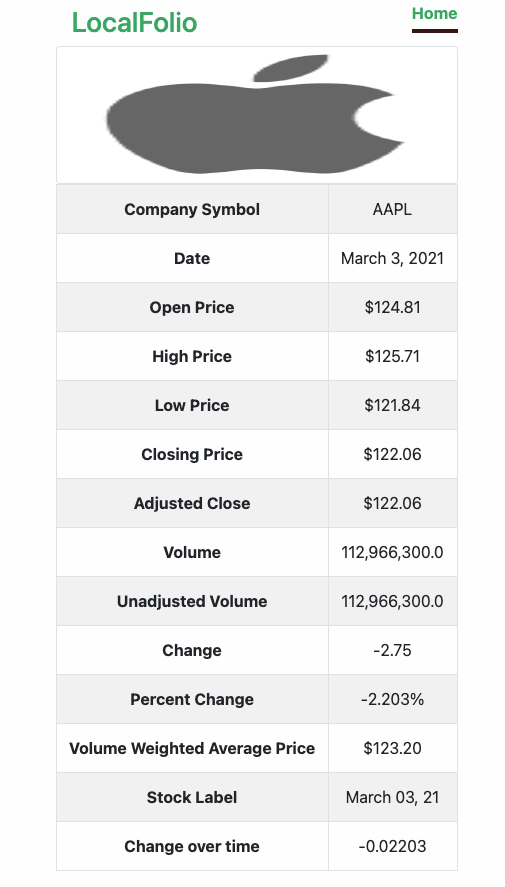
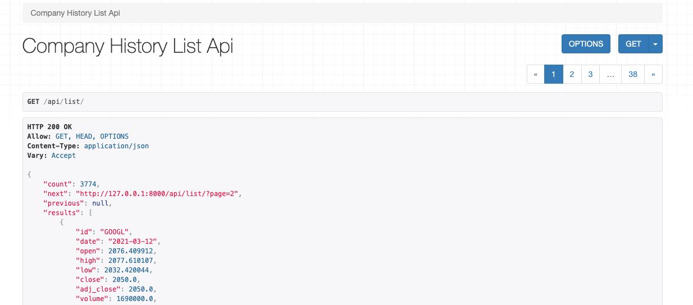

# Django

## Launch App

```
$ make install
$ make run
```

Sample .env.prod file:

```
DJANGO_SETTINGS_MODULE=myservice.settings.production
DJANGO_SECRET_KEY=areallysupersecretkey
DEBUG=False
STATIC_URL=/static/
STATIC_ROOT=static
ALLOWED_HOSTS='*','localhost'
```

## Utilities and useful commands

- Developer mode

```
$ make install && make dev
```

- Docker compose

Build project and start

```
$ docker-compose build
```

Start with a pre-built project

```
$ docker-compose up
```

- Lint and Prettify code

```
$ make lint
```

- Coverage and test

Run only tests

```
$ make test
```

Run coverage

```
$ make coverage
```

Clean up the database

```
$ make clean
```

See Makefile for more details.


## Screenshots:

- The landing page



- The Stock history list page



- The Stock filter page

  

- The Stock detail page



- Rest API page


